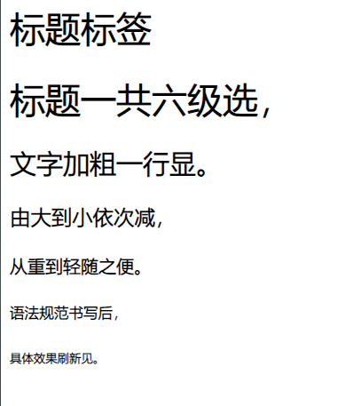

# HTML
## 1.2什么是HTML

##### HTML是超文本标记语言，它不是一种编程语言，而是一种标记语言
##### 标记语言是一套标签

#### 所谓超文本，有两层含义：
1. 它可以加入图片，声音，多媒体等内容（超越了文本限制）
2. 它还可以从文件跳转到另一个文件，与世界各地主机的文件链接（超级链接文本）

## 1.2 Web标准 

标准  | 说明
------------- | -------------
结构  | 结构用于对**网页元素**进行整理和分类，现阶段主要学的是HTML。
表现  | 表现用于设置网页元素的版式、颜色、大小等**外观样式**，主要指的是CSS
行为  | 行为是指网页模型的定义及**交互**的编写，现阶段主要学的是javascript
##### Web标准的最佳体验方案:结构、样式、行为相分离。
##### 简单理解：结构写到HTML文件中，表现写到CSS文件中，行为写到JavaScript文件中。
## HTML基本标签

标签名|定义|说明
---|---|---
\<html>\</html>|HTML标签|页面中最大的标签，我们称为跟标签
\<head>\</head>|文档的头部|注意在head标签中我们必须要设置的标签是title
\<title>\</title>|文档的标题|让页面拥有一个自己的网页标题
\<body>\</body>|文档的主体|元素包含文档的所有内容，页面内容基本都是放到body里面的
## vs code自动生成的标签
#### 1.文档声明类标签：
##### <!DOCTPPE> 文档类型声明，作用是告诉浏览器使用哪种HTML版本来显示网页
##### 注意：

1. \<!DOCTYPE>声明位于文档的最前面的位置，位于\<html>标签之前。

2. <!DOCTYOE>不是一个HTML标签，它就是文档类型声明标签。

  #### 2.lang 语言标签：
  ##### 用来定义文档显示的语言
  #### 3.字符集
  ##### 在\<head>标签内，可以通过\<meta>标签的charset属性来规定文档应使用哪种字符编码。

  ```html
  <meta charset="UTF-8" />
  ```

  ## HTML常用标签

#### 1.标题标签\<h1>-\<h6>

> 标签语义：作为标题使用，并且依据重要性递减。

##### 特点：

1. 加了标题的文字会变得加粗，字号也会依次变大
2. 一个标题独占一行
##### 总结：
```html
<h1>标题标签</h1>
<h1>标题一共六级选，</h1>
<h2>文字加粗一行显。</h2>
<h3>由大到小依次减，</h3>
<h4>从重到轻随之便。</h4>
<h5>语法规范书写后，</h5>
<h6>具体效果刷新见。</h6>
```
##### 效果演示:


####  2.段落和换行标签
	\<p> 我是一个段落标签 \</p>
> 标签语义：可以把HTML文档分割成若干个段落。

##### 特点：
1. 文本在一个段落中会根据浏览器的窗口的大小自动换行。
2. 段落和段落之间保有空隙。
#### 换行标签
	\<br />
> 标签语义：强制换行。

#####  特点：

1. \<br />是个单标签
2. \<br />标签只是简单地开始新的一行，跟段落不一样，段落之间会插入一些垂直的间距。

  #### 3.文本格式化标签
语义 | 标签 | 说明
---- | ---- | ----
加粗 |\<strong>\</strong>或者\<b>\</b>|更推荐使用\<strong>标签加粗 语义更强烈
倾斜|\<em>\</em>或者\<i>\</i>|更推荐使用\<em>标签加粗 语义更强烈
删除线|\<del>\</del>或者\<s>\</s>|更推荐使用\<del>标签加粗 语义更强烈
下划线|\<ins>\</ins>或者\<u>\</u>|更推荐使用\<ins>标签加粗 语义更强烈
#### 4.\<div>和\<span>标签

> \<div>和\<dpan>是没有语义的，它们就是一个盒子，用来装内容的。
>

```html
<div>内容\/div>
<span>内容</span>
```

##### 特点：

1. \<div>标签用来布局，但是一行只能放一个\<div>。相当于一个大容器
2. \<span>标签用来布局，一行可以多个\<span>。小容器
#### 5.图像标签和路径
##### 图像标签
属性|属性值|说明
---|---|---
src|图片路径|必须属性
alt|文本|替换文本。图像不能显示时显示的文字
title|文本|提示文本。鼠标放到图像上，显示的文字
width|像素|设置图像的宽度
height|像素|设置图像的高度
border|像素|设置图像的边框粗细

##### 重点：

1. 图像标签可以拥有多个属性，必须在标签名的后面。
2. 属性之间不分先后顺序，标签名与属性、属性与属性之间必须用空格分开。
3. 属性采取键值对的形式，即key="value"，属性="属性值"。

##### 相对路径

相对路径分类|符号|说明
------|-----|------
同一级路径||图片文件位于HTML文件同一级 如
下一级路径|/|图片文件位于HTML文件下一级 如
上一级路径|../|图片文件位于HTML文件上一级 如
#### 6.超链接标签
##### 语法格式
​	\<a herf="跳转目标" target="目标窗口的弹出方式"> 文本或图像\</a>

属性|作用
--|--
herf|用于指定链接目标的url地址，（必须属性）当标签应用href属性时，它就具有了超链接功能
target|用于指定链接页面的打开方式，其中_self为默认值，——blank为在新的窗口中打开
##### 空链接：
​	\<a href="#">文字或图片\</a>
##### 下载链接：
如果href里面是一个文件或压缩包，会下载这个额反面

##### 锚链接：

> 当点击链接，可以快速定位当前页面的某个位置

- 在链接文本的href属性中，设置属性值为**#名字**的形式，如\<a href="#two#>第二集\</a>
- 找到目标位置标签，里面添加一个id属性=刚才的名字，如\<h3 id="two">第二集介绍\</h3>

#### 7.注释标签
​	<!-- 注释语句 --> 快捷键: ctlr + /
#### 8.特殊字符
​	&nbsp //空格
<a href="https://blog.csdn.net/Iversons/article/details/78996776" target="_blank">https://blog.csdn.net/Iversons/article/details/78996776</a>

#### 9.表格标签
```html
<table>
  <tr>
	<td>单元格内文字</td>
	...
  </tr>
  ...
</table>
```
1. \<table> \</table>是用于定义表格标签。
2. \<tr> \</tr> 标签用于定义表格中的行，必须嵌套在\<table> \</table>标签中。
3. \<td> \</td>用于定义表格中的单元格，必须嵌套在\<tr> \</tr>标签中。

##### 9.1表头单元格标签
```html
<table>
<tr>
	<th>表头</th>
	...
</tr>
...
</table>
```
##### 9.2表格属性（不常用）

- 在table里设置

属性名|属性值|描述
--|--|--
align|left、center、right|规定表格点相对周围元素的对齐方式
border|1或""|规定表格单元是否拥有边框，默认为""，表示没有边框
cellpadding|像素值|规定单元边沿与其内容之间的空白，默认为1像素
cellspacing|像素值|规定单元格之间的空白，默认2像素
width|像素值或百分比|固定表的宽度
##### 9.3表格结构标签

> 便于分清表格结构

\<thrad> \</thread>标签用于表格的头部，\<tbody> \</tbody>用于表格的主体区域

##### 9.4合并单元格

1. 先确定是跨行还是跨列
2. 找到目标单元格，写上合并方式：合并的单元格数量。比如:\<td colspan= "2">\</td>或\<td rowspan> \</td>
3. 删除多余的单元格
  #### 10.列表标签
  ##### 10.1无序列表(常用）
  \<ur>
    \<li>列表项1\</li>
    \<li>列表项2\</li>
    \<li>列表项3\</li>
    ...
  \</ur>

  ###### 注意：
1. 无序列表的各个列表项之间没有顺序之分，是并列的。
2. \<ul>\</ul>中只能嵌套\<li>\</li>，在里面放别的标签是不被允许的。
3. \<li>与\</li>之间相当与一个容器，可以容纳所有的元素。
7. 无序列表会带有自己的样式属性，但在实际使用时，会使用CSS来设置。
  ##### 10.2有序列表（不常用）
  \<or>
    \<li>列表项1</li>
    \<li>列表项2</li>
    \<li>列表项3</li>
    ...
  \</or>

  ##### 10.3自定义列表

  \<dl>
   \<dt>列表项1\</dt>
    \<dd>列表项2\</dd>
    \<dd>列表项3\</dd>
    ...
  \</dl>

  ###### 注意：
1. \<dl>\</dl>里面只能包含\<dt>和\<dd>
9. \<dt>和\<dd>个没有限制，经常是一个\<dt>对应多个\<dd>

  #### 11.表单标签
> 收集用户信息的标签

##### 11.1表单域
把范围内的表单元素信息提交给服务器

```html
<from action="url地址" method="提交方式" name="表单域名称">
各种表单元素空间
</from>
```
属性|属性值|作用
--|--|--
action|url地址|用于指定接收并处理表单数据的服务器程序的url地址。
method|get/post|用于设置表单数据的提交方式，其取值为get或post。
name|名称|用于指定表单的名称，以区分一个页面中的多个表单域。 
##### 11.2表单元素
###### 11.2.1 \<input>表单元素
​	\<input type="属性值" />

- \<input />为单标签
- type属性设置不同的属性值来指定不同的控件类型

  ###### type属性：
属性值|描述
--|--
button|定义可点击按钮（多数情况下，用于通过JavaScript启动脚本）。
checkbox|定义复选框
file|定义输入字段和"浏览"按钮，供文件上传。
hidden|定义隐藏的输入字段。
image|定义图相形式的提交按钮。
password|定义密码字段，该字段中的字符被隐藏。
radio|定义单选按钮。
reset|定义重置按钮。清除表单中的所有数据。
submit|定义提交按钮。把数据发送到服务器。
text|定义单行的输入字段。默认为20个字符。

###### 其他属性：

属性|属性值|描述
--|--|--
name|由用户自定义|定义input元素名称
vlaue|有用户自定义|规定input元素的值
checked|checked|规定input元素首次加载时应当被选中
maxlength|正整数|规定输入字段的字符中字符的最大长度
注意：\<br>
1. name和value是每个元素都有的属性值，主要给后台人员使用。
2. name表单元素的名字，要求单选框和复选框要有相同的name值。

  ###### 11.2.2 label标签
> \<label>标签用于绑定表单元素，当点击\<label>标签内的文本时，浏览器就会自动的将焦点转到或者选择对应的表单元素上。

```html
<label for="sex">男</label>
<input type="radio" name="sec" id="sex" />
```
###### 11.3.1 \<select>下拉表单元素
​	\<select>
​	  \<option>选项1\</option>
​	  \<option>选项2\</option>
​	  \<option>选项3\</option>
​	  ...
​	\</select>

1. \<select>中至少包含一对\<option>.
2. 在\<option>中定义selected="selceted"时，当前选项为默认选中项。

###### 11.4.1\<texttarea>表单元素

> 可以输入多行文本

```html
<textarea row="3" cols="20">
文本内容
</textarea>
```
